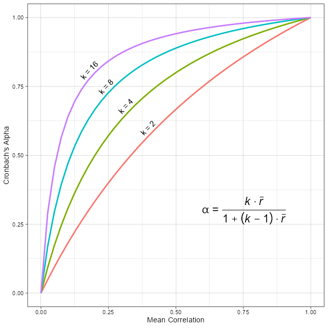

#### Experiment with 'Variance' in the correlation matrix

_Chronbach's Alpha_ is a function of the mean of the paired correlations of a set of variables. 

The _variance_ parameter adjusts the variation around the mean while giving the desired _Alpha_ value. 

 - Setting the _variance_ at '0' produces a correlation matrix with all off-diagonal values at the desired mean correlation. 
 
 - Setting _variance_ at '0.25' produces a matrix with a moderate amount of variation around the desired mean - what we might expect with a well-established scale where items are of similar value contributing to the scale.
 
 - The default value of '0.50' produces a matrix with a range of correlation values typically ranging from high to near zero, or even a few negative values. 
 
 - Setting _variance_ at '1.0' produces a matrix with a wide variation around the desired mean - typically with eigenvalues that would suggest a multidimensional scale. 
 
 - Setting _variance_ at higher values, risks creating a matrix that is non-positive-definite, and so not feasible. 
 
 
 
 
 
#### Experiment with different values for _alpha_ 

Keep the same number of items and change the value for _alpha_.

_Cronbach's Alpha_ is a function of:

 - _k_, the number of items used to make the summated (or average) scale
 
 - _r&#x305;_, the mean of all pairwise correlations of the _k_ items
 
and is given by the formula:

<!---
$$ 
\alpha = {{k * \bar{r} } \over {1 + (k - 1) * \bar{r} }} 
$$
--->
 

See how different values for _alpha_ affect the resulting correlation matrix.

#### Experiment with different numbers of items 

Keep the same value for _alpha_ and change the number of items.

Different numbers of items in the scale affect values in the correlation matrix at the same _alpha_ values.

 - Note that fewer items require higher correlations to achieve a desired _Cronbach's Alpha_. 
 
     * that is, if item correlations are low, then you can increase _alpha_ by 
     increasing the number of items.
     * Is that a good thing?
 
<!---
 
 --->
 
 
 
##### Relationship between _&alpha;_ and _r&#x305;_ at different number of items, _k_.
 
 <figure>
    
    <figcaption>To achieve the same _alpha_, mean correlation must increase when the scale has fewer items.</figcaption>
</figure>

---- 

